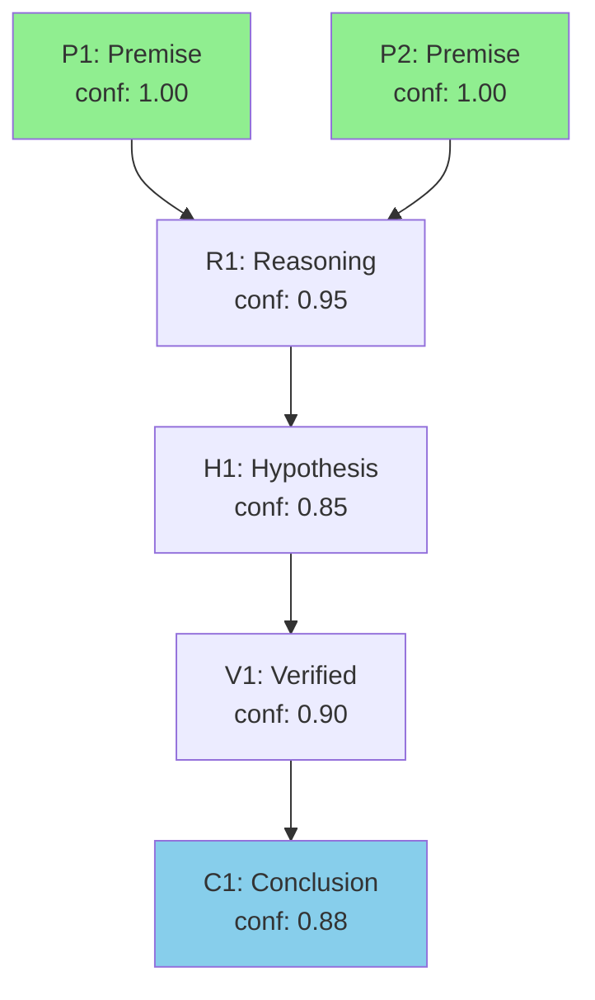

# Atomise - Atom of Thoughts Reasoning

> Decompose complex problems into minimal, self-contained "atomic" units of thought. Unlike chain-of-thought (linear, history-dependent), AoT operates as a Markov process: each state depends only on the current contracted state, not the full history. This prevents error accumulation and enables backtracking.

```
/atomise "<problem>" [--mode] [--flags]
    |
    +-> Phase 0: SETUP
    |     +- Restate problem (1 sentence)
    |     +- Extract premises as atoms (conf=1.0)
    |     +- Ensemble sketch: Direct / Decompose / Reframe
    |
    +-> Phase 1-N: ITERATION LOOP
    |     |
    |     +-> ATOMICITY GATE
    |     |     Can answer from verified atoms? -> SOLVE directly
    |     |
    |     +-> DECOMPOSE
    |     |     Build dependency DAG of atomic subquestions
    |     |
    |     +-> SOLVE + VERIFY
    |     |     +- Solve leaf atoms first, propagate up
    |     |     +- Every hypothesis needs verification
    |     |     +- If conf < 0.6, decompose further
    |     |
    |     +-> CONTRACT (Markov update)
    |     |     Create standalone state (drop history)
    |     |
    |     +-> EVALUATE
    |           +- TERMINATE if conf >= MIN_CONFIDENCE
    |           +- BACKTRACK if conf < 0.5
    |           +- CONTINUE otherwise
    |
    +-> OUTPUT: Answer, confidence, atom table, risks
```

---

## Arguments

```
$ARGUMENTS

Depth Modes (pick one):
  --light              Fast mode: depth 3, confidence 0.70
  (default)            Standard: depth 5, confidence 0.85
  --deep               Exhaustive: depth 7, confidence 0.90

Domain Modes (pick one):
  (none)               General reasoning
  --math               Mathematical proofs and calculations
  --logic              Logical arguments and validity
  --code               Code analysis (types, invariants, tests)
  --security           Security analysis (threats, attacks)
  --design             Architecture decisions (tradeoffs, constraints)

Output Control:
  --verbose            Full atom table with all metadata
  --quiet              Final conclusion only (no atom table)
  --json               JSON output for programmatic use
  --mermaid            Generate Mermaid dependency graph

State Persistence:
  --save <file>        Save atom chain to JSON for later
  --load <file>        Resume from saved atom chain

Parameters (advanced):
  --max-depth N        Override max depth (1-10)
  --min-confidence N   Override min confidence (0.5-0.99)
```

---

## Atom Schema

Each atom is a minimal, self-contained unit of thought:

```
{atomId, atomType, content, dependencies[], confidence, isVerified, depth}
```

| Field | Type | Description |
|-------|------|-------------|
| `atomId` | string | Unique ID: P1, R1, H1, V1, C1 (by type) |
| `atomType` | enum | premise / reasoning / hypothesis / verification / conclusion |
| `content` | string | The atomic thought (1-3 sentences max) |
| `dependencies` | string[] | atomIds this depends on |
| `confidence` | float | 0.0 to 1.0 |
| `isVerified` | boolean | Has passed verification? |
| `depth` | int | Distance from root premises |

### Atom Types

| Type | Prefix | Purpose | Initial Conf |
|------|--------|---------|--------------|
| `premise` | P | Given facts, constraints | 1.0 |
| `reasoning` | R | Logical inference | Derived |
| `hypothesis` | H | Tentative claim to test | max 0.7 unverified |
| `verification` | V | Result of testing | Derived |
| `conclusion` | C | Final answer | Derived |

---

## Confidence Rules

### Base Rules
1. **Premises (given facts):** confidence = 1.0
2. **Assumptions (not given):** cap at 0.6 until verified
3. **Derived atoms:** conf = min(parent confs) x verify_factor
4. **Unverified atoms:** max 0.7 (provisional)

### Verification Factors

| Result | Factor | Effect |
|--------|--------|--------|
| Strong confirmation | 1.05 | Slight boost (capped at 1.0) |
| Confirmed | 1.0 | Maintains confidence |
| Partial | 0.85 | Reduces confidence |
| None | 1.0 | No change |
| Refuted | 0.3 | Major reduction |

### Propagation Formula

```
atom.confidence = min([dep.confidence for dep in dependencies]) * verify_factor
```

### Backtrack Trigger

```
IF atom.confidence < BACKTRACK_THRESHOLD (default 0.5):
    prune_descendants(atom)
    restore_to_last_contraction()
    try_alternative_from_ensemble()
```

---

## Execution Protocol

### Phase 0: Setup

**RESTATE** the problem in 1 sentence.

**PREMISES** - Extract as atoms:
- Given facts -> [P1], [P2]... (conf=1.0)
- Assumptions -> tag "ASSUMPTION" (conf<=0.6)

**ENSEMBLE SKETCH** (2 sentences each):
- A) **Direct** - Solvable immediately?
- B) **Decompose** - What subquestions unlock this?
- C) **Reframe** - Alternative formulation?

Select best approach or hybridize.

### Phase 1-N: Iteration Loop

```
+-------------------------------------------------------+
| STEP 1: ATOMICITY GATE                                |
|                                                       |
| Can CurrentState be answered from verified atoms?     |
| - YES -> Jump to STEP 3 (solve directly)              |
| - NO  -> Continue to STEP 2                           |
+-------------------------------------------------------+
                          |
                          v
+-------------------------------------------------------+
| STEP 2: DECOMPOSE                                     |
|                                                       |
| Build dependency DAG of atomic subquestions:          |
|   Atom -> [DependsOn...]                              |
|                                                       |
| Rules:                                                |
| - Each atom: 1-2 sentences or single calculation      |
| - Leaf nodes have no unresolved dependencies          |
+-------------------------------------------------------+
                          |
                          v
+-------------------------------------------------------+
| STEP 3: SOLVE + VERIFY                                |
|                                                       |
| - Solve leaf atoms first, propagate upward            |
| - Every hypothesis needs >=1 verification atom        |
| - Select verification method based on domain          |
|                                                       |
| LOCAL REFINEMENT: If key atom conf < 0.6 ->           |
|                   decompose that atom further         |
+-------------------------------------------------------+
                          |
                          v
+-------------------------------------------------------+
| STEP 4: CONTRACT (Markov update)                      |
|                                                       |
| Create ContractedState[depth=N] in <=2 sentences:     |
| - Verified results needed going forward               |
| - Remaining unknowns                                  |
| - Next subgoal                                        |
|                                                       |
| DROP all other context - state must be standalone     |
+-------------------------------------------------------+
                          |
                          v
+-------------------------------------------------------+
| STEP 5: EVALUATE                                      |
|                                                       |
| TERMINATE if:                                         |
| - Can answer from contracted state                    |
| - Conclusion confidence >= MIN_CONFIDENCE             |
|                                                       |
| BACKTRACK if:                                         |
| - Best path yields conf < 0.5 after verification      |
| - Return to previous ContractedState                  |
| - Try alternative from ensemble sketch                |
|                                                       |
| OTHERWISE: Continue to next depth                     |
+-------------------------------------------------------+
```

---

## Verification Methods

Select method based on domain mode:

### General (all domains)

| Method | When | How |
|--------|------|-----|
| `consistency_check` | Any reasoning | No contradictions with verified atoms |
| `counterexample_search` | Hypothesis | Try to find case that disproves |
| `dependency_valid` | Any with deps | All dependencies verified |

### Math Mode (--math)

| Method | When | How |
|--------|------|-----|
| `arithmetic_check` | Numeric claims | Step-by-step calculation |
| `algebraic_verify` | Equations | Substitute and confirm |
| `proof_check` | Logical steps | Validate inference rules |
| `boundary_test` | Ranges | Test edge cases |

### Logic Mode (--logic)

| Method | When | How |
|--------|------|-----|
| `contradiction_test` | Any claim | Check if negation contradicts |
| `completeness_check` | Final reasoning | All cases covered? |
| `validity_proof` | Arguments | Sound from premises? |

### Code Mode (--code)

| Method | When | How |
|--------|------|-----|
| `type_check` | Type claims | Verify compatibility |
| `invariant_verify` | Loop/state | Confirm invariant holds |
| `test_case_gen` | Behavior | Generate confirming test |
| `complexity_check` | Performance | Verify Big-O |

### Security Mode (--security)

| Method | When | How |
|--------|------|-----|
| `threat_model` | Security claims | Map to threat categories |
| `attack_surface` | Defense claims | Enumerate attacks |
| `adversarial_test` | Any hypothesis | Assume attacker view |

### Design Mode (--design)

| Method | When | How |
|--------|------|-----|
| `tradeoff_analysis` | Decisions | Enumerate pros/cons |
| `constraint_sat` | Architecture | All requirements met? |
| `feasibility_check` | Implementation | Technically achievable? |

---

## Output Format

### Standard Output

```
ANSWER: {clear result}
CONFIDENCE: {0.0-1.0} - {1-2 sentence justification}

KEY ATOMS: [P1, R2, H1, V1, C1]

CONTRACTIONS:
- depth 0: {original problem}
- depth 1: {contracted state after first iteration}
- depth N: {final contracted state}

ATOMS:
| atomId | type | content | deps | conf | verified |
|--------|------|---------|------|------|----------|
| P1 | premise | ... | [] | 1.0 | Y |
| P2 | premise | ... | [] | 1.0 | Y |
| R1 | reasoning | ... | [P1,P2] | 0.95 | Y |
| H1 | hypothesis | ... | [R1] | 0.85 | Y |
| V1 | verification | ... | [H1] | 0.90 | Y |
| C1 | conclusion | ... | [H1,V1] | 0.88 | Y |

OPEN RISKS: {what would raise or lower confidence}
```

### Verbose Output (--verbose)

Adds:
- Full dependency graph
- Each verification step with reasoning
- Confidence propagation log
- Backtrack history (if any)
- Alternative paths considered

### Quiet Output (--quiet)

```
ANSWER: {result}
CONFIDENCE: {0.0-1.0}
```

### JSON Output (--json)

```json
{
  "problem": "...",
  "parameters": {"maxDepth": 5, "minConfidence": 0.85, "domain": null},
  "atoms": [
    {"atomId": "P1", "atomType": "premise", "content": "...", "dependencies": [], "confidence": 1.0, "isVerified": true, "depth": 0}
  ],
  "contractions": [
    {"depth": 0, "state": "..."},
    {"depth": 1, "state": "..."}
  ],
  "backtracks": [],
  "conclusion": {"content": "...", "confidence": 0.88, "supportingAtoms": ["P1", "R1", "H1"]}
}
```

### Mermaid Output (--mermaid)



---

## State Persistence

### Save State

```bash
/atomise "Complex problem" --save atoms.json
```

Saves to `.claude/atomise/atoms.json`:
```json
{
  "problem": "...",
  "timestamp": "2025-12-14T10:30:00Z",
  "currentDepth": 3,
  "atoms": [...],
  "contractions": [...],
  "nextSubgoal": "..."
}
```

### Load and Resume

```bash
/atomise --load atoms.json
```

Resumes from saved contracted state, continuing the iteration loop.

---

## Usage Examples

### Basic Usage

```bash
# Simple question
/atomise "What causes a deadlock in concurrent programming?"

# Mathematical proof
/atomise "Prove that the sum of angles in a triangle is 180 degrees" --math

# Code debugging
/atomise "Why does this function return null unexpectedly?" --code
```

### Light Mode (Quick Analysis)

```bash
# Fast decision
/atomise "Should I use useState or useReducer here?" --light

# Quick security check
/atomise "Is this input validation sufficient?" --light --security
```

### Deep Mode (Exhaustive)

```bash
# Critical architecture decision
/atomise "Should we migrate to microservices?" --deep --design

# Security audit
/atomise "Is this authentication flow secure?" --deep --security
```

### With Visualization

```bash
# See dependency graph
/atomise "Trace the data flow in this component" --mermaid --code

# Full reasoning trace
/atomise "Optimal algorithm for this problem?" --verbose --math
```

### Multi-Session

```bash
# Save for later
/atomise "Design the new API schema" --save api-design.json

# Resume tomorrow
/atomise --load api-design.json
```

---

## Light vs Deep Comparison

| Aspect | Light | Default | Deep |
|--------|-------|---------|------|
| Max Depth | 3 | 5 | 7 |
| Min Confidence | 0.70 | 0.85 | 0.90 |
| Backtrack Threshold | 0.50 | 0.60 | 0.70 |
| Verification | Basic | Standard | Exhaustive |
| Use Case | Quick decisions | General | Critical analysis |

---

## Integration

### With TodoWrite

For actionable conclusions, automatically creates tasks:

```
TodoWrite:
  - content: "Implement: [AoT conclusion step 1]"
    status: "pending"
    activeForm: "Implementing AoT conclusion"
```

### With Code Problems (--code)

1. Reads relevant source files via Read tool
2. Extracts function signatures as premises
3. Maps type constraints
4. Generates test cases for verification

---

## Anti-Patterns

```
BAD:  /atomise "What's 2+2?"
      Too trivial - just answer directly

BAD:  /atomise "Design entire system" --light
      Too complex for light mode

BAD:  /atomise "Is this SQL safe?" (no domain)
GOOD: /atomise "Is this SQL safe?" --security --code

BAD:  Ignoring low confidence and forcing conclusion
GOOD: Let AoT backtrack and explore alternatives
```

---

## When to Use AoT

| Scenario | Use AoT? |
|----------|----------|
| Complex multi-step reasoning | Yes |
| Debugging with unclear root cause | Yes |
| Architecture decisions | Yes |
| Security analysis | Yes |
| Simple factual questions | No |
| Trivial calculations | No |
| Pure information lookup | No |

---

## Remember

1. **Atomic = Minimal.** Each atom should be 1-2 sentences max.
2. **Verify everything.** Hypotheses need verification atoms.
3. **Contract aggressively.** Drop context, keep only what's needed.
4. **Backtrack freely.** Low confidence = try another path.
5. **Confidence propagates.** Children can't exceed parent confidence.
